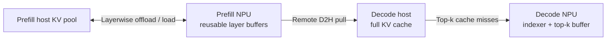

# Layerwise and Sparse KV Cache Offloading

## 1. Background

KV cache is a major NPU memory cost in long-sequence inference. Prefill and
Decode have different performance characteristics, so they use different
offloading strategies:

| Stage | Feature | What remains on the NPU |
| :--- | :--- | :--- |
| Prefill | Layerwise KV Cache Offload | A few reusable full-layer KV buffers |
| Decode | Sparse KV Cache Offload | Indexer cache and a hot top-k KV buffer |

Prefill has enough computation to overlap full-layer transfers. Decode does
not, so it keeps the full KV cache in host memory and loads only the top-k
entries needed by sparse attention.

The design comes from
[RFC #48203](https://github.com/vllm-project/vllm/issues/48203). Its experiments
show the potential to substantially increase sequence length or batch size, but
actual results depend on the model, hardware, and configuration.

## 2. Layerwise KV Cache Offload for Prefill

### How it works

Layerwise Prefill KV Cache Offload maps many logical layers onto a smaller
number of physical NPU buffers:

1. load a layer's cached KV into a reusable buffer;
2. run attention;
3. save the updated KV to host memory; and
4. reuse the buffer only after the save and any remote read complete.

Multiple buffers allow transfer and computation to overlap. The current
implementation uses `AscendStoreConnector` with the Memcache backend.

### Requirements

- Use a dedicated Prefill node with `kv_role: "kv_producer"`.
- Use `backend: "memcache"` and `use_layerwise: true`.
- Use an MLA, SFA, or DSA attention backend with eager execution.
- Install MemFabric Hybrid first, then Memcache Hybrid on the Prefill node.
  Memcache is the host KV Pool backend; MemFabric is its dependency.
- Configure `mmc-meta.conf` and `mmc-local.conf`, and start MetaService before
  starting Prefill.

Install the dependencies in order:

```bash
pip install memfabric-hybrid
pip install memcache-hybrid
```

Prepare the host before starting Prefill:

```bash
echo 200000 > /proc/sys/vm/nr_hugepages
source /usr/local/memcache_hybrid/set_env.sh
source /usr/local/memfabric_hybrid/set_env.sh
export PYTHONHASHSEED=0
```

### Configuration

This example keeps layer 0 independent and assigns all other layers to three
reusable buffers:

```json
{
    "kv_connector": "AscendStoreConnector",
    "kv_role": "kv_producer",
    "kv_connector_extra_config": {
        "backend": "memcache",
        "use_layerwise": true,
        "layerwise_num_shared_buffers": 3,
        "layerwise_independent_layers": [0]
    }
}
```

| Parameter | Description |
| :--- | :--- |
| `layerwise_num_shared_buffers` | Number of reusable NPU buffers. More buffers use more memory but provide more opportunity to overlap transfer and computation. |
| `layerwise_independent_layers` | Layers that keep dedicated buffers. The default is `[0]`; `"all"` disables cross-layer reuse. |

The buffer count is workload-dependent. Start with two to four buffers and tune
it according to NPU memory and transfer bandwidth.

### Verification and limitations

The following log means buffer reuse is active:

```text
Layerwise KV cache reuse merged ... descriptors into ... descriptors using ... buffer assignments.
```

- Shared-buffer offload currently requires Memcache and eager execution.
- Context parallelism has not been validated.
- AscendStore's own layerwise P/D transfer does not support TP mismatch. This
  limitation does not apply when `SfaRemoteD2HConnector` performs P/D transfer.
- MTP layers and optional SFA indexer caches participate in buffer reuse and
  memory accounting automatically.

## 3. Sparse KV Cache Offload for Decode

### How it works

Sparse KV Cache Offload stores the full KV cache in host memory. The NPU keeps:

- the indexer cache used to select important tokens; and
- a hot buffer containing recently used top-k KV entries.

On each Decode step, entries already in the hot buffer are reused and only
cache misses are loaded from host memory. `SfaRemoteD2HConnector` transfers the
Prefill KV cache directly into the Decode-side storage.

### Requirements

- Use a sparse-attention model such as
  [GLM-5.2](https://huggingface.co/zai-org/GLM-5.2) or
  [DeepSeek-V3.2](https://huggingface.co/deepseek-ai/DeepSeek-V3.2).
- Use disaggregated P/D deployment and enable the feature only on Decode.
- Tensor parallelism is supported; context and pipeline parallelism are not.
- Model Runner V1 is required.
- Install MemFabric Hybrid release 1.2. The current version requires NPU driver
  `25.5.1` or later.
- Install Clang and OpenMP if they are not already available in the image.

If MemFabric Hybrid 1.2 is not already installed in the image:

```bash
pip uninstall -y memfabric_hybrid
git clone https://gitcode.com/Ascend/memfabric_hybrid.git -b release/1.2
cd memfabric_hybrid
bash script/build_and_pack_run.sh
bash output/memfabric_hybrid-1.2.0_linux_aarch64.run
export MEMFABRIC_HYBRID_EXTEND_LIB_PATH=/usr/local/memfabric_hybrid/1.2.0/aarch64-linux/lib64
```

### Configuration

Add the following options to the Decode launch command:

```bash
--additional-config '{
    "sparse_kv_offload_config": {
        "enabled": true,
        "topk_buffer_size": 4096,
        "dram_size_per_dp_GB": 128
    }
}' \
--kv-transfer-config '{
    "kv_connector": "SfaRemoteD2HConnector",
    "kv_role": "kv_consumer",
    "kv_port": 20050,
    "kv_connector_extra_config": {
        "transfer_backend": "memfabric",
        "use_layerwise": true
    }
}'
```

| Parameter | Description |
| :--- | :--- |
| `topk_buffer_size` | Device hot-buffer size. It must be at least `index_topk` and divisible by `block_size`. Twice `index_topk` is a practical starting point. |
| `dram_size_per_dp_GB` | Host memory reserved per DP rank. It must hold the full KV cache. TP ranks share this pool. |
| `keep_device_kv_cache` | Debug-only option that retains the full device KV cache. Keep it `false` in production. |

## 4. Use Them Together

The combined data flow is:



### Prefill configuration

Use `MultiConnector` so Prefill can save KV to Memcache and expose the same
layer buffer to Decode:

```json
{
    "kv_connector": "MultiConnector",
    "kv_role": "kv_producer",
    "kv_connector_extra_config": {
        "connectors": [
            {
                "kv_connector": "SfaRemoteD2HConnector",
                "kv_role": "kv_producer",
                "kv_port": 20050,
                "kv_connector_extra_config": {
                    "transfer_backend": "memfabric"
                }
            },
            {
                "kv_connector": "AscendStoreConnector",
                "kv_role": "kv_producer",
                "kv_connector_extra_config": {
                    "backend": "memcache",
                    "use_layerwise": true,
                    "layerwise_num_shared_buffers": 3,
                    "layerwise_independent_layers": [0]
                }
            }
        ]
    }
}
```

Do not enable `sparse_kv_offload_config` on Prefill. A reusable Prefill buffer
is released only after AscendStore has saved it and Decode has completed the
Remote D2H read.

### Decode configuration

Use the Sparse KV Cache Offload configuration from chapter 3. Decode owns the
destination and pulls main KV directly into its host pool; indexer KV remains
in rank-local NPU memory.

### Proxy

Start the layerwise proxy after Prefill and Decode are ready:

```bash
python examples/disaggregated_prefill_v1/load_balance_proxy_layerwise_server_example.py \
    --host 127.0.0.1 \
    --port 9000 \
    --prefiller-hosts 127.0.0.1 \
    --prefiller-ports 8100 \
    --decoder-hosts 127.0.0.1 \
    --decoder-ports 8200
```

Use reachable addresses for multi-node deployment. Do not advertise
`0.0.0.0`, because Decode calls the proxy's `/v1/metaserver` endpoint. Send
inference requests to the proxy port (`9000` in this example).

### Deployment checklist

- Set `transfer_backend` to `memfabric` on both Prefill and Decode.
- Prefill TP must be greater than or equal to Decode TP and divisible by it.
- `kv_port` is the Decode control-port base. Reserve
  `decode_data_parallel_size * decode_tensor_parallel_size` consecutive ports.
  Prefill does not bind these ports; Decode supplies the target through request
  metadata.

For implementation details, see
[SFA Remote D2H Connector Design](../../developer_guide/Design_Documents/sfa_remote_d2h_connector.md).
